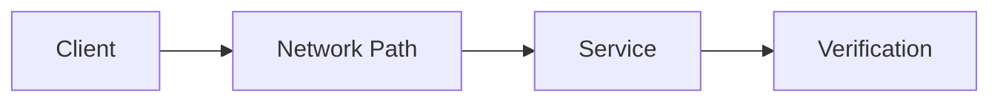

# Lab Output Template

Use this template for every networking, cybersecurity, or AI-assisted operations lab. Keep it concise, evidence-based, and production-focused.

---

# Lab Title

## 1. Lab Summary

**Lab:**

**Date completed:**

**Topic area:**

**Difficulty:**

**Status:** Completed / Partially completed / Blocked

### Objective

State the purpose of the lab in 2-4 lines.

---

## 2. Scenario

Describe the real-world situation this lab simulates.

---

## 3. Reference Material

List the sources used for the lab.

| Area | Reference |
| --- | --- |
| Networking theory | |
| Socket programming | |
| Automation | |
| Cybersecurity | |
| AI-assisted operations | |
| Operations / sysadmin practice | |

---

## 4. Requirements

| ID | Requirement | Status |
| --- | --- | --- |
| R1 | | Not started / Passed / Failed / Partial |
| R2 | | Not started / Passed / Failed / Partial |
| R3 | | Not started / Passed / Failed / Partial |

---

## 5. Constraints

List anything you were not allowed to do.

---

## 6. Assumptions

Record any assumptions made before or during the lab.

---

## 7. Expected Structure

Show the expected files and folders for the lab.

```text
example-topic-folder/
└── lab-xx-example-lab.md
```

---

## 8. Deliverables

| File or output | Purpose |
| --- | --- |
| | |
| | |

---

## 9. Implementation Tasks

Use these tasks as a guide, not as a full walkthrough.

### Task 1

Describe the required outcome.

### Task 2

Describe the required outcome.

### Task 3

Describe the required outcome.

---

## 10. Key Commands Used

| Command | Purpose |
| --- | --- |
| | |
| | |

---

## 11. Files Created or Changed

| Path | Purpose |
| --- | --- |
| | |
| | |

---

## 12. Verification Evidence

This section proves the lab worked.

| Check | Evidence | Result |
| --- | --- | --- |
| | | Passed / Failed |
| | | Passed / Failed |

---

## 13. Diagram

Use this section for network diagrams, traffic-flow diagrams, architecture diagrams, monitoring flows, AI-assisted analysis flows, or failure/recovery flows.



---

## 14. Issues Encountered

| Issue | Cause | Fix |
| --- | --- | --- |
| | | |

If there were no issues, write:

> No major issues encountered.

---

## 15. Decisions Made

| Decision | Reason |
| --- | --- |
| | |
| | |

---

## 16. Security and Production Considerations

Explain the production relevance of this lab.

Cover operational risk, access control, rollback, audit trail, monitoring, repeatability, documentation, reliability, and AI risk where relevant.

---

## 17. AI Usage and Validation

Complete this section if AI was used.

| AI use | Output produced | How it was validated | Result |
| --- | --- | --- | --- |
| | | | Useful / Incorrect / Incomplete / Not used |

If AI was not used, write:

> AI was not used in this lab.

---

## 18. Final Outcome

State clearly whether the lab was completed.

---

## 19. What I Learned

Write 3-6 bullet points.

- 
- 
- 

---

## 20. What I Would Improve in Production

Write 2-5 bullet points.

- 
- 

---

## 21. References Used

| Reference | Used for |
| --- | --- |
| | |
| | |

---

## 22. Completion Checklist

- [ ] Requirements understood
- [ ] Reference material reviewed
- [ ] Implementation completed
- [ ] Verification evidence captured
- [ ] Issues documented
- [ ] Decisions documented
- [ ] Production considerations documented
- [ ] AI usage documented if relevant
- [ ] Diagram added if useful
- [ ] Files committed with clear messages
- [ ] Work pushed to GitHub
- [ ] Evidence reviewed before publishing

---

## 23. Reflection Questions

1. What problem did this lab simulate?
2. What network layer or service was most important?
3. What evidence proved the final state?
4. What failed or was confusing?
5. What would you monitor in production?
6. What would you document for the next engineer?
7. What would you automate next?
8. Did AI help, mislead, or need correction in this lab?
9. What would make this lab output look professional?
