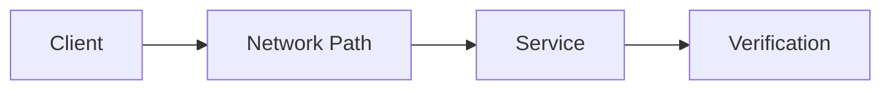

# Lab Output Template

Use this template for every networking, cybersecurity, or AI-assisted operations lab. The learner should focus on solving the lab. Documentation is produced from the learner's evidence, commands, outputs, screenshots/summaries, issues encountered, and answers to seven reflection questions.

---

# Lab Title

## 1. Lab Summary

**Lab:**

**Date completed:**

**Topic area:**

**Difficulty:**

**Status:** Completed / Partially completed / Blocked

### Objective

State the purpose of the lab in 2-4 lines.

---

## 2. Scenario

Describe the real-world situation this lab simulates.

---

## 3. Reference Material

List the sources used for the lab.

| Area | Reference |
| --- | --- |
| Networking theory | |
| Socket programming | |
| Automation | |
| Cybersecurity | |
| AI-assisted operations | |
| Operations / sysadmin practice | |

---

## 4. Requirements

| ID | Requirement | Status |
| --- | --- | --- |
| R1 | | Not started / Passed / Failed / Partial |
| R2 | | Not started / Passed / Failed / Partial |
| R3 | | Not started / Passed / Failed / Partial |

---

## 5. Constraints

List anything the lab was not allowed to do.

---

## 6. Assumptions

Record assumptions made before or during the lab.

---

## 7. Expected Structure

Show the expected files and folders for the lab.

```text
example-topic-folder/
└── lab-xx-example-lab.md
```

---

## 8. Deliverables

| File or output | Purpose |
| --- | --- |
| | |
| | |

---

## 9. Implementation Tasks

Record the required tasks and the outcome of each task. This section should document what was solved, not provide a copy-paste walkthrough.

### Task 1

Describe the required outcome and final result.

### Task 2

Describe the required outcome and final result.

### Task 3

Describe the required outcome and final result.

---

## 10. Key Commands Used

| Command | Purpose |
| --- | --- |
| | |
| | |

---

## 11. Files Created or Changed

| Path | Purpose |
| --- | --- |
| | |
| | |

---

## 12. Verification Evidence

This section proves the lab worked.

| Check | Evidence | Result |
| --- | --- | --- |
| | | Passed / Failed |
| | | Passed / Failed |

---

## 13. Diagram

Use this section for network diagrams, traffic-flow diagrams, architecture diagrams, monitoring flows, AI-assisted analysis flows, or failure/recovery flows.



---

## 14. Issues Encountered

| Issue | Cause | Fix |
| --- | --- | --- |
| | | |

If there were no issues, write:

> No major issues encountered.

---

## 15. Decisions Made

| Decision | Reason |
| --- | --- |
| | |
| | |

---

## 16. Security and Production Considerations

Explain the production relevance of this lab.

Cover operational risk, access control, rollback, audit trail, monitoring, repeatability, documentation, reliability, and AI risk where relevant.

---

## 17. AI Usage and Validation

Complete this section if AI was used.

| AI use | Output produced | How it was validated | Result |
| --- | --- | --- | --- |
| | | | Useful / Incorrect / Incomplete / Not used |

If AI was not used, write:

> AI was not used in this lab.

---

## 18. Final Outcome

State clearly whether the lab was completed.

---

## 19. What I Learned

Summarise the main learning points from the lab and the learner's reflection answers.

- 
- 
- 

---

## 20. What I Would Improve in Production

Summarise the production improvements from the lab and the learner's reflection answers.

- 
- 

---

## 21. References Used

| Reference | Used for |
| --- | --- |
| | |
| | |

---

## 22. Completion Checklist

- [ ] Requirements understood
- [ ] Reference material reviewed
- [ ] Implementation completed
- [ ] Verification evidence captured
- [ ] Issues documented
- [ ] Decisions documented
- [ ] Production considerations documented
- [ ] AI usage documented if relevant
- [ ] Seven reflection questions answered
- [ ] Diagram added if useful
- [ ] File uploaded to the correct topic folder
- [ ] Evidence reviewed before publishing

---

## 23. Reflection Questions

Ask exactly seven reflection questions after the learner has completed the practical work. The learner answers the questions; the answers are then incorporated into the final uploaded lab document.

1. What problem did this lab simulate?
2. What was the most important networking, security, automation, or AI concept in this lab?
3. What evidence proved that your solution worked?
4. What issue, mistake, or confusing point did you encounter, and how did you resolve it?
5. What would you monitor, log, or alert on in production?
6. What would you improve if this were a real production environment?
7. What did you learn from this lab that you could explain to another engineer?
